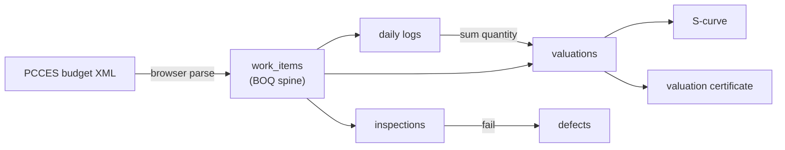

# PMIS — Construction Project Management Information System

> A web PMIS for Taiwan public‑works **contractors**. It ingests the government **PCCES**
> bill of quantities and turns it into a live backbone for **cost, schedule and quality** —
> multi‑tenant, with every project's data isolated by Postgres Row Level Security.

**▶ Live demo: https://ryanxxhuang.github.io/PMIS/**


---

## What it does

Public construction in Taiwan runs on a standard procurement contract and a structured
**PCCES eTender** budget — the 標單 (bill of quantities). PMIS treats that bill of quantities
as the **spine**: import it once and estimating, scheduling and quality all hang off the same
work‑item tree, so quantities never get re‑keyed and the numbers always reconcile.

### Cost &amp; schedule
- 📋 **Bill of quantities** — upload a PCCES budget XML; it is parsed **in the browser** into a
  3,000+ row work‑item tree (項次 / 數量 / 單價 / 複價) and stored per project.
- 📝 **Daily site logs** — record completed quantity per work item, per day.
- 💰 **Progress valuations (估驗計價)** — quantity‑based monthly billing that **auto‑fills its
  cumulative quantities from the daily logs**, then computes retention and net payable.
- 📈 **S‑curve** — planned vs. actual progress (actual derived live from valuations) with a
  behind‑schedule indicator.
- 🖨 **Valuation certificate** — print / export a formal payment document as PDF.

### Quality — three‑tier QC (三級品管)
- 🔍 **Inspections → defects** — raise an inspection, record pass/fail; a failure **auto‑opens a
  linked defect** that moves through 開立 → 改善中 → 待複查 → 已結案.

### Multi‑tenant
Sign up, create a project, and work in your own isolated workspace. Owners can switch between
projects, add members, and delete projects. Row Level Security guarantees a user only ever sees
rows for the projects they belong to.

---

## How it fits together



---

## Tech stack

| Layer | Choices |
|---|---|
| Frontend | React 18 · Vite 5 · React Router 6 (HashRouter) · Tailwind CSS 4 |
| Backend | Supabase — Postgres, Auth (email/password), Row Level Security |
| BOQ parsing | PCCES eTender XML via in‑browser `DOMParser` ([`src/lib/parsePcces.js`](src/lib/parsePcces.js)); a Python port lives in [`scripts/import_boq.py`](scripts/import_boq.py) |
| Hosting | GitHub Pages (static SPA) |

There is no server of our own: the SPA talks directly to Supabase with a *publishable* key, and
security is the database's job (RLS).

---

## Getting started

```bash
git clone https://github.com/ryanxxhuang/PMIS.git
cd PMIS
npm install
cp .env.example .env        # fill in VITE_SUPABASE_URL + VITE_SUPABASE_ANON_KEY
npm run dev                 # http://localhost:5173
```

Backend (Supabase project + schema): see **[supabase/SETUP.md](supabase/SETUP.md)**.
The full, idempotent database schema is one file: **[supabase/schema.sql](supabase/schema.sql)**.

## Deploy

GitHub Pages in one command (build + push to the `gh-pages` branch):

```bash
npm run deploy
```

The app uses `HashRouter` and relative asset paths, so it runs from any static host or
sub‑path with no server‑side routing config.

---

## Project structure

```
src/
  lib/
    supabase.js      Supabase client (guarded — falls back to a local prototype if unset)
    parsePcces.js    PCCES budget XML → work-item tree
    boqCalc.js       tree building + cumulative-amount maths (shared by valuation & progress)
  pages/web/         Dashboard · BOQ · SiteLog · Valuation · ValuationPrint · Progress · Quality
  store.jsx          application state + all Supabase reads/writes
supabase/
  schema.sql         complete database schema (idempotent)
  SETUP.md           backend setup guide
scripts/
  import_boq.py      offline PCCES XML → JSON importer (used to seed the sample BOQ)
```

## Security

Every table has Row Level Security enabled, sharing one `is_project_member()` predicate.
The publishable key is designed to be public — it is RLS, not the key, that protects data. The
`service_role` / secret key is never shipped to the browser.

---

<sub>Sample data is the public PCCES budget for the 國際原住民族文化創意產業園區新建工程 tender
(~NT$0.94B, 3,262 work items), used purely to demonstrate the BOQ pipeline.</sub>
