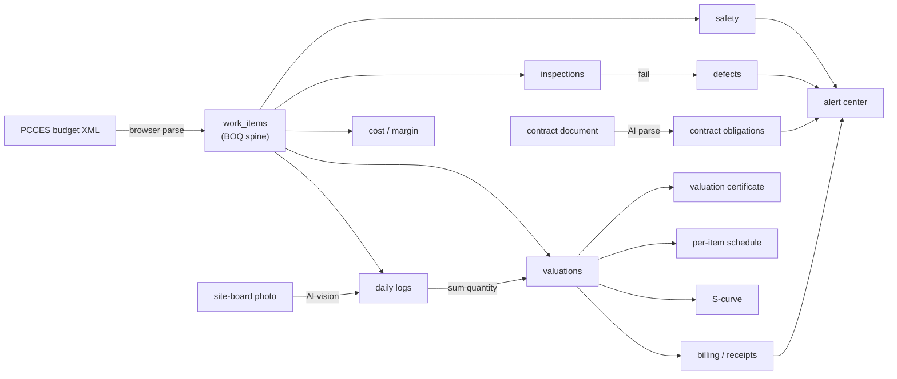
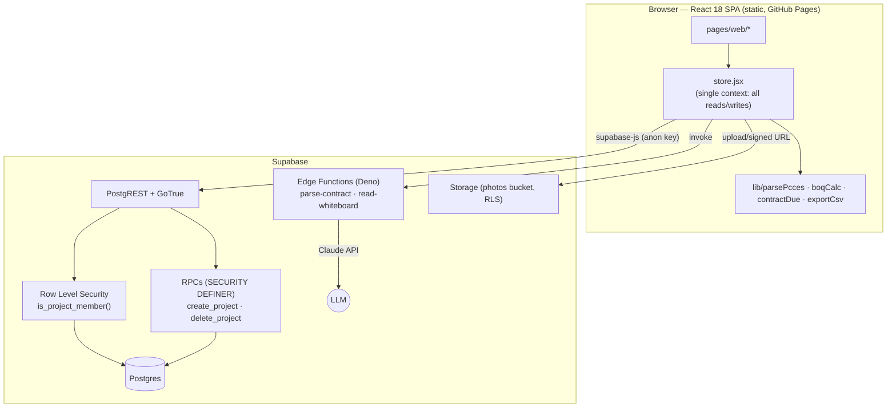

# PMIS — Construction Project Management Information System

> A web PMIS for Taiwan public‑works **contractors**. It ingests the government **PCCES**
> bill of quantities and turns it into a live backbone for **cost, cash‑flow, schedule,
> quality and safety** — with AI that reads site-board photos and parses contract deadlines,
> multi‑tenant, every project's data isolated by Postgres Row Level Security.

**▶ App: https://ryanxxhuang.github.io/PMIS/ · Demo (no sign-up): https://ryanxxhuang.github.io/PMIS/demo/ · Site: https://ryanxxhuang.github.io/**


---

## What it does

Public construction in Taiwan runs on a standard procurement contract and a structured
**PCCES eTender** budget — the 標單 (bill of quantities). PMIS treats that bill of quantities
as the **spine**: import it once and estimating, cash‑flow, scheduling, quality and cost all
hang off the same work‑item tree, so quantities never get re‑keyed and the numbers always
reconcile.

### 總覽 · Overview
- 📊 **Dashboard** — contract value, billed‑to‑date, completion %, schedule status, open
  defects/inspections at a glance.
- 🔔 **Alert center (提醒中心)** — one place that surfaces everything due or overdue: contract
  deadlines, defect remediation, unfinished safety issues, and 已核定‑未請款 / 已請款‑未收款
  payments. Each row links to its source screen. A daily **email digest** (Edge Function +
  pg_cron + Resend) mails members whenever anything is overdue or due within 7 days.
- 📅 **Contract control (契約管制)** — **AI parses the uploaded contract** into every time‑based
  obligation (start‑work‑within‑X‑days, monthly reports, submittals…), each with its trigger,
  computed due date, penalty and source clause. Due dates recompute live from a few anchor dates.
- 📰 **Monthly report (施工月報)** — pick a month; it auto‑compiles progress, valuations,
  a per‑work‑item completed‑quantity table, quality/safety/change‑order stats, and an
  **AI‑drafted review + next‑month plan**. Print / save as PDF.

### 成本與進度 · Cost & schedule
- 📋 **Bill of quantities** — upload a PCCES budget XML; it is parsed **in the browser** into a
  3,000+ row work‑item tree (項次 / 數量 / 單價 / 複價) and stored per project (IndexedDB cached).
- 📝 **Daily site logs** — completed quantity per work item, per day, with site photos.
  📷 **Snap the site board → AI fills the log** (date, weather, work items + quantities matched
  back to the BOQ). Also captures the full **工程會 official daily‑log format** (labour, plant,
  materials, safety, sampling) with a dedicated print page.
- 💰 **Progress valuations (估驗計價)** — quantity‑based monthly billing that **auto‑fills its
  cumulative quantities from the daily logs**, then computes retention and net payable; status
  workflow 草稿 → 監造審核 → 已核定 gated by role.
- 🧾 **Billing & receipts (請款收款)** — per‑period 本期估驗 / 保留款 / 應領, invoice & payment
  tracking (待請款 / 已請款 / 已收款) and a cash‑flow summary.
- 🧮 **Cost & margin (成本管理)** — budget vs. actual cost by category (材料/人工/機具/分包/管理費),
  subcontracts as cost lines, and live **gross margin** = contract revenue − cost.
- 🔧 **Change orders (變更設計)** — 追加/減帳 line items; only 核准 ones adjust the revised contract
  amount (flowed into valuation / S‑curve / cost denominators). **Upload the revised PCCES XML →
  it diffs against the current BOQ and drafts the add/deduct line items automatically.**
- 📈 **S‑curve** — planned vs. actual progress (actual derived live from valuations) with a
  behind‑schedule indicator.
- 🗓️ **Per‑item schedule (逐工項排程)** — planned start/finish on key items; status
  (未開始 / 進行中 / 落後 / 已完成) derived from today vs. plan and the latest valuation.
- 🖨 **Valuation certificate** — print / export a formal payment document as PDF.

### 品質與工安 · Quality & safety
- 🔍 **Quality — three‑tier QC (三級品管)** — raise an inspection, record pass/fail; a failure
  **auto‑opens a linked defect** that moves 開立 → 改善中 → 待複查 → 已結案. 📷 **snap a defect
  photo → AI fills the defect form**.
- ✅ **Self‑inspection checklists (自主檢查表)** — a template's quantified limits judge each entered
  measurement live (○/✕); a failing sheet **auto‑opens a defect**; prints as an official checklist.
- 🧪 **Specimen testing (取樣試驗)** — pulls concrete‑pour days from the daily logs, auto‑sets
  7/28‑day test due dates (into the alert center + email), and **auto‑judges 28‑day compressive
  strength** per 03310 (fail → auto defect).
- 👁 **Observations (觀察事項)** — lightweight site notes (softer than a defect); resolve them or
  **escalate to a formal defect** in one click.
- 🦺 **Safety (工安管理)** — self‑checks, safety deficiencies (remediation flow), training and
  hazard notices — public‑works required, exportable per type.

### 監造協作 · Supervisor collaboration
- 📄 **Submittals (送審文件)** — contractor submits (施工計畫 / 品質計畫 / 材料 / 樣品); supervisor
  受理 → 核准 / 核備 / 退回補正; contractor 修正再送 (revision +1). Ball‑in‑court workflow.
- ❓ **RFIs (工程疑義)** — contractor raises, supervisor answers, contractor confirms close; flags
  schedule / cost impact.
- 🖍 **Drawing / photo markup** — box, arrow and text over a drawing screenshot, site photo, or
  **PDF page**, attached to an RFI or defect so both sides see the same circled spot.
- 🎯 **Ball‑in‑court** — every collaboration item shows whose turn it is (⏳ 待監造 / 待廠商, ✓ done);
  the dashboard tallies 球在廠商 N / 球在監造 M across all of them.
- 👥 **Project members (專案成員)** — invite supervisor / owner / partner accounts by email;
  permissions follow each member's org type. **Role‑based UI**: contractor files & submits,
  supervisor approves & closes, owner is read‑only (the project creator has full rights).

Every list — cost, payments, defects, daily logs, safety, schedule, submittals, RFIs — **exports
to CSV** (UTF‑8 BOM, so Excel renders Chinese correctly); the dashboard has a **whole‑project
JSON export**. The whole UI is **mobile‑responsive** with a drawer nav for use on site.

### AI features (Claude API)
Four Supabase Edge Functions call the Claude API through a shared layer (`_shared/claude.ts`,
forced tool‑use = schema‑guaranteed JSON; Haiku for vision/short text, Sonnet for long docs):
**read‑whiteboard** (site‑board photo → daily‑log fields), **describe‑defect** (defect photo →
defect form), **draft‑monthly‑review** (stats → 檢討/下月計畫), **parse‑contract** (contract →
time‑based obligations). Keys live only in server secrets.

### Multi‑tenant
Sign up, create a project, work in your own isolated workspace. Owners switch between projects,
invite members, delete projects. Row Level Security guarantees a user only ever sees rows for the
projects they belong to.

### Features by screen

| Route | Screen | What you do there |
|---|---|---|
| `/login` | **Login / Sign‑up** | Email + password auth. Sign‑up captures `org_type` (施工廠商 / 監造 / 機關) and role. |
| `/project/new` | **Project setup** | Create a project (owner / contractor / supervisor / dates). First‑run gate: the workspace won't open until a project exists. |
| `/dashboard` | **Dashboard** | Contract value, item counts, billed‑to‑date and schedule status at a glance. |
| `/alerts` | **Alert center** | Aggregates 逾期 / 即將到期(7日) / 待處理 across contract obligations, defects, safety issues and payments. |
| `/contract` | **Contract control** | Set anchor dates → upload contract → **AI extracts obligations + penalties**; phase‑grouped list with live due dates, countdowns and source clauses. |
| `/boq` | **Bill of quantities** | Drag‑drop a PCCES XML → parsed in‑browser → imported into `work_items` in batches. Browse the 3,000‑row tree; re‑import resets the project. |
| `/site-log` | **Daily site log** | One record per day; enter completed quantity per work item + photos. 📷 site-photo AI auto‑fill. Feeds valuations. |
| `/valuation` | **Progress valuation (估驗計價)** | Per‑period billing; "fill from site logs" sums daily quantities; auto‑computes cum %, amount, retention, net payable; status workflow 草稿→送審→監造審核→已核定→已請款. |
| `/payments` | **Billing & receipts** | Per‑period 本期估驗 / 保留款 / 應領; invoice & payment dates + amount; cash‑flow totals. CSV export. |
| `/cost` | **Cost & margin** | Budget vs. actual cost by category + subcontracts; live gross‑margin (budget & actual). CSV export. |
| `/progress` | **S‑curve** | Planned baseline (smoothstep S‑curve over project months) vs. actual derived from valuations; flags behind‑schedule. |
| `/schedule` | **Per‑item schedule** | Assign planned start/finish to key items; per‑item 未開始/進行中/落後/已完成 from plan + valuation. CSV export. |
| `/change-orders` | **Change orders (變更設計)** | 追加/減帳 items; 核准 ones adjust the revised contract amount. Upload revised PCCES XML → auto‑diff line items. |
| `/monthly-report` | **Monthly report (施工月報)** | Pick a month → auto‑compiled report + AI‑drafted review/plan; print/PDF. |
| `/quality` | **Quality (三級品管)** | Inspections, defects (auto‑opened on fail, AI photo fill), 自主檢查表 (auto‑judge), 取樣試驗 (fc′ auto‑judge), 觀察事項 (escalate to defect). |
| `/safety` | **Safety (工安)** | Self‑checks, safety deficiencies (remediation flow), training & hazard notices. CSV per type. |
| `/submittals` | **Submittals (送審文件)** | Contractor submits, supervisor 核准/核備/退回補正, contractor 修正再送. Ball‑in‑court. |
| `/rfi` | **RFIs (工程疑義)** | Contractor asks (with drawing markup), supervisor answers, contractor closes; schedule/cost impact flags. |
| `/members` | **Project members (專案成員)** | Invite by email; role legend by org type; creator manages the roster. |
| `/valuation/print` | **Valuation certificate** | Print/PDF a formal payment document (standalone route). |
| `/site-log/print` | **Official daily log** | 工程會 公共工程施工日誌 format, print/PDF. |
| `/quality/checklist-print` | **Self‑inspection sheet** | Official 自主檢查表 format with ○/✕ judgments, print/PDF. |

---

## How it fits together



---

## System architecture

PMIS is a **static React SPA** talking straight to **Supabase** over PostgREST/GoTrue with a
*publishable* anon key. The database does the heavy lifting — auth, authorization (RLS),
constraints, and the operations that need elevated rights (SECURITY DEFINER RPCs). The only
custom server code is a handful of **Edge Functions** that call an LLM for the AI features (they never
touch the DB; they take a file in and return structured JSON).



**One store, two modes.** [`src/store.jsx`](src/store.jsx) is the single source of truth — it
owns React state *and* every Supabase call. A `dbMode` flag (`isSupabaseConfigured && a real
project is selected && its BOQ lives in the DB`) decides where data comes from:

- **DB mode** — work items, valuations, schedule, site logs, quality, cost, safety, contract
  obligations and per‑item schedules all load from / persist to Postgres, scoped to the project.
- **Sample fallback** — if Supabase env vars are unset, or a project has no imported BOQ yet, the
  app degrades to the bundled sample BOQ so the demo always runs. The UI shape is identical.

**Request lifecycle.** Sign in → load this user's projects → pick the last‑used (or first) →
load its `work_items` (paged 1,000 rows at a time past the PostgREST cap) → derive lookup maps
(`item_key ↔ uuid`) → load valuations / schedule / site logs / quality / cost / safety / contract
obligations / item schedules for that project.

**The BOQ spine.** Import maps each parsed item to a client‑generated UUID so parent/child links
survive the round‑trip (`parent_key → parent_id`), then inserts in `sort_order` so parents land
before children (FK‑safe). Everything downstream references `work_item_id`, so quantities are
never re‑keyed. Cumulative valuation amounts are computed as `contract_amount × (done_qty /
contract_qty)` and rolled up the tree ([`lib/boqCalc.js`](src/lib/boqCalc.js)) — using
amount×ratio (not unit‑price×qty) so a 100 %‑complete item bills exactly its contract amount with
no rounding drift.

**AI features.** All are Supabase Edge Functions calling the Claude API (shared layer
`functions/_shared/claude.ts`; Haiku for vision, Sonnet for long documents) with structured
(json‑schema) output:
- **read‑whiteboard** — a site-board photo → `{ log_date, weather, work_summary, items[] }`;
  items are fuzzy‑matched back to BOQ leaves before filling the daily log.
- **parse‑contract** — a contract (digital PDF/Word → text extracted in‑browser via `pdf.js` /
  `mammoth`; scanned/image → base64 vision) → a list of obligations matching `contract_obligations`.
  Deadlines are stored as **rules** (trigger event + offset days), so one parse re‑resolves against
  the project's anchor dates and recomputes if a date slips.

### Data model

All 24 domain tables are project‑scoped and cascade from `projects`. Every one has RLS enabled,
gated by the caller's project membership (`my_project_ids()`).

| Table | Role |
|---|---|
| `profiles` | Extends `auth.users`; auto‑created on sign‑up via trigger (`org_type`, company, role). |
| `projects` · `project_members` | A project and its membership; creator auto‑added as `admin`. Anchor dates (award/notice/commencement) live here. |
| `work_items` | **The BOQ spine** — the PCCES work‑item tree (項次/數量/單價/複價, kind, leaf/rollup, billable, weight). |
| `valuations` · `valuation_items` | Progress billing per period; items hold cumulative quantity + derived cum %/amount, tagged `source = manual \| daily_log`; invoice/payment fields for cash‑flow. |
| `schedule_periods` · `item_schedules` | S‑curve baseline (monthly `planned_pct`) and per‑item planned start/finish. |
| `daily_logs` · `daily_log_items` | One log per day; per‑item completed quantity that feeds valuations, plus the official‑format fields (labour/plant/materials/safety as JSONB). |
| `photos` | Site‑log photo + markup metadata; files live in the `photos` Storage bucket (object‑level RLS by project). |
| `inspections` · `defects` | Three‑tier QC; a failed inspection auto‑opens a linked defect (`markup_path` for circled evidence). |
| `checklist_templates` · `checklist_records` | Self‑inspection checklists (quantified limits) and judged submissions. |
| `test_samples` | Concrete specimens — 7/28‑day due dates and fc′ auto‑judgment. |
| `observations` | Lightweight site notes; can escalate into a defect. |
| `change_orders` · `change_order_items` | 變更設計 追加/減帳; approved net flows into the revised contract amount. |
| `contract_obligations` | AI‑extracted time‑based duties + penalties (deadline stored as a rule). |
| `cost_items` · `safety_records` | Cost ledger (budget vs. actual, subcontracts) and the safety log. |
| `submittals` · `rfis` | Supervisor collaboration — submittal review flow and RFIs (`markup_path`). |

`SECURITY DEFINER` RPCs cover what RLS alone can't express: `create_project` /
`delete_project`, and member management (`add_member_by_email`, `list_project_members`,
`remove_member`) — email→user lookup and cross‑member reads need elevated rights.

---

## Tech stack

| Layer | Choices |
|---|---|
| Frontend | React 18 · Vite 5 · React Router 6 (HashRouter) · Tailwind CSS 4 |
| Backend | Supabase — Postgres, Auth (email/password), Row Level Security, Storage, Edge Functions (Deno) |
| AI | Claude API (Haiku 4.5 vision / Sonnet 5 long‑doc, forced tool‑use structured output) via Edge Functions; in‑browser text extraction with `pdf.js` (`pdfjs-dist`) and `mammoth` |
| BOQ parsing | PCCES eTender XML via in‑browser `DOMParser` ([`src/lib/parsePcces.js`](src/lib/parsePcces.js)); a Python port lives in [`scripts/import_boq.py`](scripts/import_boq.py) |
| Hosting | GitHub Pages (static SPA) |

The SPA ships only a *publishable* key; security is the database's job (RLS). The
`service_role` / secret key and the `OPENAI_API_KEY` live only as server‑side secrets (Edge
Functions), never in the browser.

---

## Getting started

```bash
git clone https://github.com/ryanxxhuang/PMIS.git
cd PMIS
npm install
cp .env.example .env        # fill in VITE_SUPABASE_URL + VITE_SUPABASE_ANON_KEY
npm run dev                 # http://localhost:5173
npm test                    # vitest — BOQ maths, contract deadlines, PCCES parser
```

CI (GitHub Actions) runs `npm test` + `npm run build` on every push and PR to `main`.

Backend (Supabase project + schema): see **[supabase/SETUP.md](supabase/SETUP.md)**.
The full, idempotent database schema is one file: **[supabase/schema.sql](supabase/schema.sql)** —
paste it into the SQL editor and run.

**AI features** (optional) need the Edge Functions deployed and an Anthropic key set:

```bash
supabase functions deploy parse-contract
supabase functions deploy read-whiteboard
supabase secrets set OPENAI_API_KEY=sk-...
```

## Deploy

GitHub Pages in one command (build + push to the `gh-pages` branch):

```bash
npm run deploy
```

The app uses `HashRouter` and relative asset paths, so it runs from any static host or
sub‑path with no server‑side routing config.

---

## Project structure

```
src/
  lib/
    supabase.js      Supabase client (guarded — falls back to a sample mode if unset)
    parsePcces.js    PCCES budget XML → work-item tree (browser DOMParser)
    boqCalc.js       tree building + cumulative-amount maths (shared by valuation/progress/cost)
    contractDue.js   resolve an obligation's due date from trigger + rule + anchor dates
    exportCsv.js     table → CSV download (UTF-8 BOM for Excel CJK)
  pages/
    Login.jsx        auth (sign-in / sign-up)
    web/             ProjectSetup · Dashboard · Alerts · Contract · BOQ · SiteLog ·
                     Valuation · ValuationPrint · Payments · Cost · Progress ·
                     Schedule · Quality · Safety
  components/        Layout.jsx (app shell + responsive nav) · ui.jsx (shared primitives)
  data/              workItems.json (sample BOQ) · seed.js (small no-Supabase fallback)
  store.jsx          single context: all React state + every Supabase read/write
  App.jsx            routes + auth/project gating
supabase/
  schema.sql         complete database schema, RLS + RPCs (idempotent)
  functions/         Edge Functions — parse-contract · read-whiteboard (Claude API)
  SETUP.md           backend setup guide
scripts/
  import_boq.py      offline PCCES XML → JSON importer (used to seed the sample BOQ)
```

## Security

Every table has Row Level Security enabled, sharing one `is_project_member()` predicate; the
`photos` Storage bucket is gated the same way at the object level. The publishable key is
designed to be public — it is RLS, not the key, that protects data. Secret keys
(`service_role`, `OPENAI_API_KEY`) live only in Edge Function secrets, never in the browser.

---

<sub>Sample data is the public PCCES budget for the 國際原住民族文化創意產業園區新建工程 tender
(~NT$0.94B, 3,262 work items), used purely to demonstrate the BOQ pipeline.</sub>
