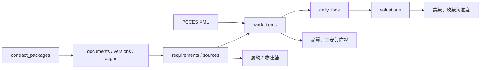
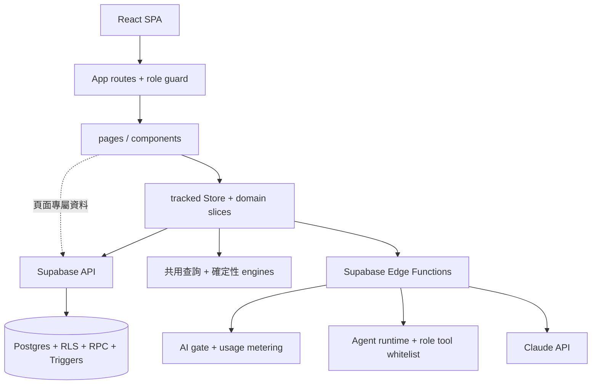

# GovAgent／PMIS

> **GovAgent** 是最終產品：讓政府機關每位承辦人都有一個懂業務、法規與文書格式的 AI Agent。
> **PMIS** 是目前第一個垂直領域——公共工程專案管理——的專案名稱與程式庫名稱。

- 正式站：<https://gov-agent.ai>
- 目前系統真相：[CURRENT.md](CURRENT.md)
- 開發基準：[DEVELOPMENT.md](DEVELOPMENT.md)
- 已定案決策：[docs/DECISIONS.md](docs/DECISIONS.md)
- 文件索引：[docs/README.md](docs/README.md)


## 現階段產品

PMIS 讓公共工程的施工廠商、監造單位與主辦機關在同一專案協作：

- PCCES 標單、施工日誌、估驗計價、請款收款、成本、S 曲線與逐工項排程。
- 品質查驗、ITP、自主檢查、取樣試驗、缺失與工安管理。
- 契約文件、履約需求、送審、RFI、變更設計、驗收結算與稽核留痕。
- 廠商、監造、機關三種 Agent；廠商 Agent 同時支援現場與品管工作，AI 只查詢、彙整與產生草稿。
- 多租戶 Supabase 後端；RLS、狀態 Guard Trigger 與 Audit Trigger 是安全邊界。
- AI 功能開關、方案、用量與成本管理。

平台目前只做公共工程，不為尚未開始的其他政府業務預先建立抽象框架。

## 核心資料模型

系統有兩條互相連接的脊椎。


```mermaid
flowchart LR
  XML["PCCES XML"] --> WI["work_items"]
  WI --> LOG["daily_logs"]
  LOG --> VAL["valuations"]
  VAL --> PAY["請款、收款與進度"]
  WI --> QC["品質、工安與佐證"]

  PKG["contract_packages"] --> DOC["documents / versions / pages"]
  DOC --> REQ["requirements / sources"]
  REQ --> WI
  REQ --> ART["履約產物連結"]
```

- 工程數量與財務資料以 `work_item_id` 串接。
- 文件解析結果只有經人審查、成為 `approved` Requirement 後才具權威性。
- 金額、期限與合格判定由確定性程式或資料庫 Trigger 執行，不交給 AI 自行計算。

完整現況與已知架構債見 [CURRENT.md](CURRENT.md)。

## 系統架構


```mermaid
flowchart TB
  Browser["React SPA"] --> Routes["App routes + role guard"]
  Routes --> Pages["pages / components"]
  Pages --> Store["tracked Store + domain slices"]
  Pages -. "頁面專屬資料" .-> API["Supabase API"]
  Store --> Lib["共用查詢 + 確定性 engines"]
  Store --> API
  Store --> Edge["Supabase Edge Functions"]
  Edge --> Gate["AI gate + usage metering"]
  Edge --> Agent["Agent runtime + role tool whitelist"]
  Edge --> Claude["Claude API"]
  API --> DB[("Postgres + RLS + RPC + Triggers")]
```

資料存取只遵守三條規則：

1. 多頁共用、需要同步更新的專案資料放進 [src/store.jsx](src/store.jsx) 與 [src/store/slices](src/store/slices)。
2. 只屬於單一頁面的有界資料，由頁面直接查 Supabase；目前只有 `Contract`、`Requirements`、`Activity` 三頁。
3. 相同查詢真的出現兩次以上，才抽到 `src/lib` 或 `src/store/db.js`；不為形式統一新增 repository 層。

## 角色與 AI 邊界

| Agent | 使用者 | 主要工具 |
|---|---|---|
| 廠商 Agent | 廠商指派的專案人員 | 日誌、工項、照片、檢查表、試體、缺失與送審佐證 |
| 監造 Agent | 監造工程師 | 查驗、送審審查、估驗勾稽 |
| 機關 Agent | 主辦機關承辦人 | 契約期限、付款、驗收、跨文件稽核 |

現場、品管與工安是廠商內部分工，不是權限角色。所有廠商成員可處理廠商範圍內的工作，由公司自行指派實際承辦人。

所有 Agent 都遵守：

1. 只依本案資料與工具回傳內容回答。
2. 不自行計算數字或捏造契約、法規條號。
3. 只產生草稿與建議，不核定、判定、結案或驗收。
4. 草稿寫入 `agent_actions`，由人接受或拒絕。

目前 16 個 AI／整合功能的註冊表位於：

- [src/lib/aiFeatures.js](src/lib/aiFeatures.js)：前端顯示鏡像。
- [supabase/functions/_shared/aiFeatures.ts](supabase/functions/_shared/aiFeatures.ts)：Edge Functions 鏡像。
- DB `ai_features`：執行期權威來源。

## 技術棧

| 層 | 技術 |
|---|---|
| 前端 | React 18、Vite 6、React Router、Tailwind CSS 4 |
| 後端 | Supabase Postgres、Auth、RLS、Storage、RPC、Deno Edge Functions |
| AI | Claude Haiku／Sonnet／Opus，伺服器端功能閘門與用量計量 |
| 文件解析 | PDF.js、Mammoth、PCCES XML DOMParser |
| 測試 | Vitest、Playwright、pgTAP |
| 部署 | Cloudflare Workers 靜態資產、GitHub Actions CI |
| 監控／整合 | Sentry、中央氣象署 API、Resend Email |

## 本機開發

需求：Node.js 22.13.0 以上。

```bash
git clone https://github.com/ryanxxhuang/PMIS.git
cd PMIS
npm install
cp .env.example .env
npm run dev
```

`.env` 至少需要：

```text
VITE_SUPABASE_URL=https://<project-ref>.supabase.co
VITE_SUPABASE_ANON_KEY=<publishable-key>
```

未設定 Supabase 時，前端會進入內建 Demo 模式。

## 驗證

```bash
npm test
npm run test:e2e
npm run build
```

真 Supabase staging 冒煙只在本機手動執行，不進預設 CI：

```bash
npm run test:e2e:real
```

環境與清理方式見 [真後端 E2E 操作指南](docs/REAL_BACKEND_E2E.md)。

資料庫的 RLS、RPC 與狀態轉移測試在 [supabase/tests](supabase/tests)。

2026-08-12 W5 PR #6 基線：57 個 Vitest 測試檔共 523 項、12 個 Playwright E2E、23 組 pgTAP 共 723 項全數通過，正式建置與資料庫 lint 成功。PR #6、migrations `20260812000500`／`20260812000600`，以及受共用程式影響的 `agent-run`／`send-reminders` 已於 2026-08-13 部署。

## Supabase 與部署

- 後端設定：[supabase/SETUP.md](supabase/SETUP.md)
- 資料庫唯一真相：[supabase/migrations](supabase/migrations)
- `supabase/schema.sql`：凍結的歷史參考，不用來初始化或同步資料庫。
- Cloudflare 設定：[wrangler.jsonc](wrangler.jsonc)
- 正式站搬遷紀錄：[docs/Cloudflare搬家-逐步設定指南.md](docs/Cloudflare搬家-逐步設定指南.md)

推送到 `main` 後，由 Cloudflare Workers 的 repository build 流程部署。`npm run deploy` 是已停用的舊流程，會主動失敗。

## 專案結構

```text
src/
├── App.jsx                 路由與身分／角色守衛
├── components/             共用 UI、Layout、Copilot、缺失與標註元件
├── data/                   Demo 與內建工程資料
├── lib/                    確定性引擎、文件、需求、稽核與支援函式
├── pages/                  33 個頁面檔
├── store.jsx               Store 組合根與跨領域派生資料
└── store/slices/           9 個狀態／資料操作 slices

supabase/
├── functions/              16 個 Edge Functions 與共用 Agent／AI 層
├── migrations/             Schema、RLS、RPC、Trigger 的唯一真相
├── tests/                  pgTAP 安全與狀態流程測試
├── rollbacks/              少數明確支援的回復腳本
└── SETUP.md                後端設定

docs/
├── README.md               文件索引與狀態
├── DECISIONS.md            已定案決策
├── ROADMAP.md              待確認的整理順序
├── architecture/           已實作架構決策
├── 資安/                   資安政策、符合性與弱掃證據
├── 採購/                   採購與簽辦資料
└── pitch/                  對外簡報與產生工具
```

## 文件閱讀順序

1. [DEVELOPMENT.md](DEVELOPMENT.md)：文件先行、簡單化原則與完成定義。
2. [CURRENT.md](CURRENT.md)：目前產品、系統現況與已知架構債。
3. [docs/DECISIONS.md](docs/DECISIONS.md)：已定案且不得自行推翻的決策。
4. [docs/ROADMAP.md](docs/ROADMAP.md)：候選改動；未核准前不得實作。
5. [docs/README.md](docs/README.md)：其餘文件的用途與時效。
6. [docs/PROJECT_TREE.md](docs/PROJECT_TREE.md)：完整專案樹與各目錄責任。

`SCOPE.md`、`PRD.md` 與日期式報告均為歷史快照；除非要追溯決策，不用它們判斷目前功能。
