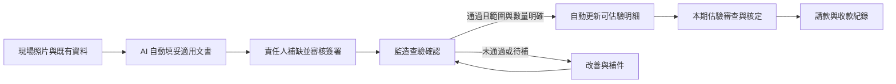

# GovAgent／PMIS 產品瘦身優化報告

> 2026-09-17｜依使用者指定的四個核心進行產品收斂評估。
> 本報告是具體取捨建議；尚未刪改功能、變更角色權限或套用資料庫 migration。四核心方向及下列「使用者補充確認」來自使用者，個別退場與技術實作方案仍是提案。
> 盤點基準：本機 repo `ab4be5f`、現行程式、CURRENT 與已接受的 Decisions。未登入正式環境實測，未盤點正式資料量，沒有使用率、客戶訪談或節省工時的實測資料。

問題：功能按工程業務拆成大量頁面，主賣點「照片變成可交付文書」仍未接成完整流程。  
目標：聚焦契約與時程提醒、估驗請款、AI 文書、三方協作，減少工程師輸入與找功能的時間。  
不做：本輪不實作、不刪正式資料、不重新設計技術架構、不擴大到其他產業。  
影響：導覽、現場紀錄、文件生命週期、估驗佐證、提醒與周邊模組退場。  
驗收：四核心現況有依據；功能逐項有去留；主要缺口明確；有分批順序；有可驗證的完成條件。

## 使用者補充確認：AI 文書與監造查驗是同一條主流程

> 2026-09-17 補充。以下是使用者明確指定的產品要求，優先於本報告原先按文件分批的建議；尚未實作。

**施工日誌、監造日誌、自主檢查表、監造查驗表單，都必須由 AI 辨識照片內容、結合契約與既有紀錄，自主填妥完整草稿，再由責任人審核、簽署與送出。監造查驗確認通過的項目，必須自動聯動估驗計價；未經監造確認的部分不能請款。**

這四類文件是第一個完整產品流程的必要範圍，可以分批開發，但不能只完成施工日誌便宣稱主賣點已交付。監造日誌是每日監造紀錄，現有「監造報表」的月份彙整不能代替它。

| 必備文書 | AI 應自主完成的工作 | 人的責任 |
|---|---|---|
| 施工日誌 | 從現場照片、白板、專案與已確認資料整理施作內容、位置、可轉錄數據及附件，填入完整日誌範本 | 廠商核對當日事實、必要缺漏與數量，簽署提送 |
| 監造日誌 | 從監造照片、當日查驗與既有正式紀錄整理監造事項、查驗情形、通知及追蹤內容，填入每日範本 | 監造核對實際執行情形並簽署；不能把廠商照片直接當成監造到場證明 |
| 自主檢查表 | 依工項與適用範本，從照片／清楚量測紀錄轉錄檢查內容、可辨識數據、位置與佐證，填好各適用欄位 | 廠商確認實測與自檢結果並簽署 |
| 監造查驗表單 | 依查驗批次與範本整理照片、檢查項目、可辨識實測、缺失、查驗範圍及可確認數量 | 監造確認查驗結果、範圍與數量並簽署；由此產生可估驗依據 |

工程師不必先輸入 prompt，也不必先選四個頁面分別打字。系統在上傳後主動辨識、選用適用範本、生成文件並列出待審清單。照片看不出或沒有可靠來源的欄位集中標待補，不能為了「填完」捏造事實；補一次後重用於適用文件。不同角色的現場證據、審查與簽署責任仍分開保存。

目標流程：

### 監造查驗與估驗的必要控制

- **以確認通過為門檻。** AI 完成查驗草稿、廠商自主檢查合格、監造填完表單，都不等於已取得可請款資格。必須有監造正式確認通過的有效紀錄。
- **聯動到具體數量與範圍。** 至少能對回專案、標單工項、施作位置／批次、計量單位、監造確認數量、確認人與文件版本。某工項曾有一次合格紀錄，不能解鎖該工項全部契約數量。
- **自動更新可估驗資料。** 監造確認後，系統自行更新可估驗清單與數量、掛上查驗表及相關佐證，不再由工程師抄到估驗表。尚未開期時留在可估驗清單；已有適用草稿期時依截止日同步，已送審或核定的期別不靜默改寫。
- **避免跨期與跨批重複請款。** 本期可新增估驗量以「截至本期截止日、有效且不重複的監造確認量，扣除前期已計價與其他進行中期別已占用量」為上限，再受核准契約量限制。同一施作批次的多張照片、多次查驗與改善後複查不能重複累加。
- **未通過的量不得混入。** 例如申報 100 m²，監造確認 60 m²，其餘 40 m² 待改善，本次最多新增 60 m²；其中若已有 20 m² 計價，剩餘最多 40 m²。已確認查驗量也不代表估驗整期已核定，仍走既有估驗核定與請款程序。
- **更正可追溯。** 查驗撤銷或修正後，重新檢查尚未核定的估驗；已核定或已請款的項目進入有紀錄的調整流程，不自動刪改舊帳。
- **後端強制阻擋。** 前端顯示可請款量，後端在送審、核定與請款相關轉移再次核對；直接 API、同時操作或手動改量也不能繞過。零散警示與停用按鈕不足以實現這項要求。

上述欄位與計算方式是落實需求的設計建議，不代表資料模型已定案。按批次多階段查驗的項目，需確認所有適用必要查驗已完成，不能把同一數量在不同階段重算。總價／間接費等非現場實體工項，需訂明監造確認的契約計價依據及單位，不能用假查驗照片或自行豁免的方式繞過「監造確認後才可請款」。

### 與現況的差距

目前 `fillValuationFromSiteLogs` 是加總施工日誌數量帶入估驗；查驗紀錄主要連到工項並記錄合格／不合格、意見與判定人時間。本次讀到的查驗建立／判定流程，尚未提供可直接用於上述控管的分批確認數量。估驗頁會彙整查驗等佐證並提示差異，這不等於已實現「監造通過的數量才可估驗」的強制控制。

依據：[估驗數量帶入](../../src/store/slices/billing.js)、[查驗建立與結果](../../src/store/slices/quality.js)、[估驗頁](../../src/pages/web/Valuation.jsx)、[佐證推導](../../src/lib/evidence.js)、[現有監造月度報表](../../src/pages/web/SupervisorReport.jsx)。

新增驗收必測：四類文書都能由照片自動起稿並完成審核簽署；未查驗／不合格不能請款；部分合格只解鎖部分量；同一批重複查驗不重複計價；跨期不可重複；查驗更正可追溯；前端與直接 API 都不能繞過。

## 1. 建議結論

**產品應圍繞一條完整工作流程：契約告訴我何時該做事，現場照片變成文書與佐證，三方審核交接，最後用同一批資料估驗請款。**

現在的主要問題，是使用者要自己串起日誌、品質、送審、期限、估驗與報表。AI 已能協助其中一些步驟，但仍有很多「工程師自己找頁面、補欄位、整理附件」的工作。

建議作以下取捨：

- **優先拔掉獨立成本／毛利／分包記帳功能。** 它是廠商內部帳務，沒有直接完成四核心中的任何一條流程。
- **移除跨案分析儀表板作為獨立產品面。** 保留選案、專案清單與必要待辦數，不繼續擴充跨案經營分析。
- **取消獨立風險稽核工作區。** 估驗超量、佐證缺漏等檢核移入估驗審查；保留必要的檢核程式與操作紀錄。
- **退出逐工項人工排程工具的獨立發展。** 把必要的關鍵工項日期接到履約時程；替代入口與既有資料承接完成後，再退場舊頁。
- **品質、工安、送審、變更與驗收縮成流程中的作業。** 這些有些直接產出文書、有些影響估驗金額或契約時程，不能全部拔掉。
- **最主要的開發投入放在「照片 → 文書草稿 → 補缺 → 審核簽署 → 提送 → 歸檔」。** 先把施工日誌、監造日誌、自主檢查與監造查驗四類文書，以及查驗通過後的估驗聯動完整做完，再擴充其他文件。

只把側欄收起來，維護負擔不會下降；只刪頁面，也不會讓 AI 自動完成文書。瘦身必須同時減少產品範圍、重複輸入與人工交接。

## 2. 四個核心，目前走到哪裡

| 核心 | 程式已有的基礎 | 尚未補齊的部分 | 本次建議 |
|---|---|---|---|
| 契約解析＋工程 timeline 提醒 | 文件分類、契約要求抽取、原文來源、履約事項、基準日與到期推算、網頁待辦、每日提醒 | 掃描契約 OCR 與語意漏抽仍有限制；未做真契約抽取準確率量測；網頁與早報涵蓋事項不同；循環義務沒有逐期期次 | 留作核心。優先做到提醒可信、能直接進入辦理，不增加第二套時程工具 |
| 估驗計價請款智慧化 | 標單量價、日誌累計帶入、逐期估驗、保留款、監造審核、請收款登錄、照片／日誌等佐證與施工說明草稿 | 使用者仍需跨頁準備與核對；佐證包尚非完整的簽署交付包；同工項照片不等於本期證據已精確選妥 | 留作核心。由「填估驗表」轉為「核對本期差異與缺件」 |
| AI 完成文書，工程師審核簽名 | 照片辨識說明、工項配對、白板轉錄、日誌與自檢草稿、部分報表／審查文字、列印版型 | 沒有一條照片驅動多文件的完整流程；部分結果只存頁面；未找到文件版本綁定的完整電子簽署流程 | **最高產品優先級。** 這是差異化最大的承諾，也是目前最需要補齊的能力 |
| 三方同平台、清楚管理流程 | 廠商／監造／機關權限、狀態轉移、球權待辦、退回補正、部分活動留痕 | 入口多；不同單據完成與退回體驗不一；送審最新意見欄無法完整保留歷次退回原因 | 留作共同骨幹。以「現在誰要做什麼、做完交給誰」呈現 |

依據：[現況](../../CURRENT.md)、[導覽與工作指引](../../src/lib/navConfig.js)、[照片處理](../../src/pages/web/SiteLog.jsx)、[估驗](../../src/pages/web/Valuation.jsx)、[佐證包](../../src/pages/web/ValuationPackage.jsx)、[Agent 邊界](../architecture/agent-tool-boundary.md)、[提醒差異](../architecture/dual-engine-sync.md)。這是程式與文件盤點，不等於四核心已通過正式環境驗收。

### 特別注意：照片辨識與完整文書之間的差距

目前照片批次辨識後，人先核對說明與工項，再按上傳；系統可建立空白日誌骨架，把工項與摘要帶進表單，仍需補數量、存檔。Agent 日誌草稿也會把無來源的數量留空。白板辨識則有另一條轉錄數量到表單、再由人確認的路徑。

因此不能把現況描述為「拍完照，所有文書已完成」。更精準的描述是：**已有照片轉錄與個別草稿能力，尚未做到一份資料自動完成整組文書與正式提送。**

目前列印版日誌、自檢表、估驗表有簽章空格，也有帳號執行核定的動作；本次在前端與 migrations 搜尋，未找到完整的文件簽署版本、簽署後凍結及送達回執機制。Storage 的 signed URL 是檔案存取方式，不能當成文件簽署功能。依據：[日誌處理](../../src/pages/web/SiteLog.jsx)、[Agent 日誌草稿](../../supabase/functions/_shared/draftDailyLog.ts)、[日誌紙本](../../src/components/SiteLogOfficialSheet.jsx)、[估驗紙本](../../src/pages/web/ValuationPrint.jsx)。

## 3. 為什麼現在感覺複雜

依 `navConfig.js` 實際計算，工作區有 **19 個子頁**，參考區有 **3 個頁面**。排除平台管理員與權限 override，一般廠商可見 20 個、監造 18 個、機關 19 個導覽末端項目；尚未計入收件匣、Agent 與非側欄頁。這是可見功能入口數，不代表全部同時展開。

| 使用者想完成的事 | 目前需要理解的區塊 | 建議收斂方式 |
|---|---|---|
| 今天施工完成，交紀錄 | 日誌、照片、品質、自檢、缺失、工安、相關列印 | 一次提交現場資料，系統列出本次能生成的文件與欠缺資料 |
| 下週有哪些契約事項 | 契約重點、擷取審核、期限追蹤、提醒、停留點、排程 | 一份履約時程；同一事項可看原文、時間、責任人與下一步 |
| 這期要請款 | 估驗、佐證包、請收款、變更、相關查驗 | 同一期別的一條辦理流程；必要來源直接在旁邊展開 |
| 對方退回後再送 | 各單據的詳情、退回原因、附件與補正操作 | 收件匣直接打開退回件，顯示差異與補正後的去向 |

**使用者應只需要認得工作，不需要記得系統的資料分類。**

## 4. 功能去留清單

「保留」指繼續投入；「合併」指保留必要能力但取消獨立日常入口；「退場」指停止作為新作業工具，待資料、相依與舊連結承接後移除程式。退場不包含刪除正式歷史資料。

### 4.1 建議停止獨立提供的功能

| 現有功能 | 結論 | 理由 | 必須承接的部分 |
|---|---|---|---|
| 成本管理 `/cost`：預算／實際成本、毛利、分包成本 | **退場，第一批** | 廠商內部帳務需要持續手動維護，與契約對機關請款是不同責任 | 已有資料可查閱／匯出；不動標單單價、保留款、估驗與付款紀錄 |
| 跨案總覽 `/portfolio` 的統計、例外分析 | **退場獨立分析頁，第一批** | 四核心首先要把單一工程的交付流程做完 | 保留選案、專案清單；必要待辦數可放選案清單，不另做分析儀表板 |
| 風險稽核 `/audit` 的獨立工作區 | **移除獨立頁，必要檢核併入估驗** | 使用者應在送件／審查當下看到問題，不必另跑稽核頁 | 估驗數量與日誌差異、查驗／試體缺漏、可追溯來源；既有 Agent 勾稽工具仍有用途 |
| 稽核意見 AI `audit.summary` | **建議退場獨立生成用途** | 對既有檢核再產一份泛用稽核文字，未必讓交件更快 | 規則與具體缺件提示保留；若契約要求正式稽核報告，作為明確文件範本另評估 |
| 逐工項排程 `/schedule` 的獨立編輯器 | **停止擴充，替代完成後退場** | 另一套手工起迄日期增加維護；它也不是完整的工程依賴排程系統 | 必要的工項起迄與工程里程碑搬入履約時程；有待辦與資料承接後才移除 |
| 已停用的 `assistant.chat`、`contract.parse` 舊路徑 | **維持停用，列入技術清理** | 已有唯一 Agent 入口與 requirements 契約來源 | 保留歷史用量、識別碼與必要舊連結；不是本輪新減少的使用者功能 |

成本與排程不只是兩個頁面，還有 store、載入、Demo 種子與初始化資料檢查等使用端。風險稽核的確定性工具也被估驗佐證使用，不能整份刪除。依據：[成本](../../src/pages/web/Cost.jsx)、[排程](https://github.com/ryanxxhuang/PMIS/blob/ab4be5f/src/pages/web/Schedule.jsx)、[store ledger](../../src/store/slices/ledger.js)、[初始化](../../src/pages/web/Dashboard.jsx)、[佐證推導](../../src/lib/evidence.js)、[AI 註冊](../../src/lib/aiFeatures.js)。

### 4.2 能力保留，入口與流程合併

| 現有功能 | 建議放到哪裡 | 保留的最小能力／範圍 |
|---|---|---|
| 契約重點＋期限追蹤 | **履約時程** | 原文依據、責任方、日期依據、提送紀錄、提醒、例外 |
| 擷取審核 | 契約上傳結果中的「核對疑慮」 | 手動補登與更正、來源核對；沿用 D-019，不重新引入每一條 AI 轉錄都要人工確認的門檻 |
| 提醒中心 | **今日工作**的期限篩選與通知偏好 | 舊提醒信深連結仍可直達；網頁與早報採一致的事項範圍 |
| 施工日誌、照片、白板辨識 | **現場紀錄** | 一次上傳與補資料，產生日誌、照片說明和其他適用文書 |
| 品質查驗、自檢、試體、缺失 | 現場紀錄的文件／待辦種類 | 現場數據、人工判定、改善與複查、估驗佐證；依工項／契約適用性出現 |
| 工安管理 | 現場紀錄的工安文件與缺失類型 | 既有工安紀錄、照片描述、改善與複查；不發展另一套人員證照／訓練管理產品 |
| 檢驗停留點 ITP | 履約時程與現場工作提示 | 「此時需要通知查驗」、一鍵帶資料申請；保留現有狀態與角色限制 |
| 送審文件 | 文件草稿的「提送」流程與今日工作 | 指定文件、附件、審查／退回／再送、版次與歷史 |
| 工程疑義 RFI | 相關工作或文件的「提出疑義」 | 正式疑義編號、答覆、責任、結案；不擴成通訊軟體 |
| 變更設計 | 履約時程／估驗中的「契約變更」 | 追加減量價、監造受理、機關核定；工期變更依據另補足，不由模型擅改 |
| 施工月報、監造報表 | 現場紀錄中的「本月文件」 | 從既有紀錄彙整，依角色生成各自文件；保留各自內容與核定責任 |
| 驗收結算 | 履約時程的竣工／驗收階段 | 階段期限、資料清單、改善／複驗、正式結果與結案文書 |
| 進度 S 曲線 | 履約時程的次要進度視圖 | 預定與估驗完成率、截止日／期別／狀態；不把估驗完成率當成每日實體進度 |
| 估驗＋請收款＋佐證包 | **估驗請款**，依期別整合 | 準備、核對、審查、核定、請款、收款紀錄；仍依原三方權限分工 |
| 標單工項 | 契約附件與估驗內的查詢／維護入口 | 工項、量價、核准變更後的金額來源；不為瘦身改成 AI 自行算錢 |
| 專案文件 | 共用的「專案資料」次入口 | 上傳、原檔、版本、搜尋、契約包、歸檔，不把所有低頻功能塞回此處 |
| 活動紀錄 | 每張文件的歷程；全案歷程放專案資料 | 誰何時改了什麼、審核與送件紀錄，保留可追溯性 |
| 三方成員 | 專案設定 | 邀請、移除、角色與專案管理員設定 |
| 全域 Agent、Copilot 與頁內 AI 按鈕 | 工作中的「幫我處理」與一個輕量問答入口 | 契約查詢、說明、草稿與既有有用工具；主要工作不要求使用者先打 prompt |

合併不表示把資料表、權限、表單與狀態全部統一。施工日誌、查驗結果、變更核定仍是不同業務紀錄；使用者的入口一致，業務規則保持清楚。

### 4.3 保留在背後的必要基礎

三方權限、登入安全、專案隔離、原始文件／照片、核定與修訂紀錄、AI 閘門與用量、錯誤監控、備份與必要平台管理應保留。這些使四核心可用、可查證，不需要成為一般使用者的日常選單。

`requirements` 與 `contract_obligations` 是契約內容及執行狀態的分工；`project_members` 與契約方快照也承擔不同責任。本次不建議為減少表數而合併。依據：[開發邊界](../../DEVELOPMENT.md)、[決策](../DECISIONS.md)。

## 5. 瘦身後使用者看到什麼

建議四個主要入口，共用同一個專案切換器。文件搜尋、專案資料、成員設定放次入口；不再常駐列出二十個工具。

| 主要入口 | 使用者要完成的事 | 預設畫面 |
|---|---|---|
| **今日工作** | 知道現在輪到我做什麼 | 現在輪到我／等待對方／已完成；期限、原因與主要動作直接在列上 |
| **現場紀錄** | 上傳照片、讓 AI 整理文書、審核送出 | 廠商優先看「拍照／上傳」；監造看待查驗與待審文件；機關依權限查閱 |
| **履約時程** | 知道工程接下來要做什麼、依據在哪裡 | 近期事項優先，按需展開全期；原文、責任、期限與相關單據同處 |
| **估驗請款** | 知道本期可請多少、缺什麼、卡在哪裡 | 期別、金額差異、缺件、審查與請收款進度 |

「今天要做什麼」與「整個工程接下來要做什麼」共用事項來源，只是時間範圍不同。首頁不另存一份任務狀態，也不新增通用專案管理看板。

首頁中的「已完成」若擴為完整歷史，需補足各單據可靠完成時間；目前「今天已完成」只涵蓋有可靠時間戳的部分事項，不能直接更名就宣稱涵蓋全部。

三個角色看同一筆資料、各自完成有權執行的動作：

| 廠商 contractor | 監造 supervisor | 機關 owner |
|---|---|---|
| 上傳現場資料、核對草稿、提送、補正、提報估驗與請款 | 查驗、審查、退回、估驗核定、編製監造文書 | 契約級核定、付款紀錄、驗收與履約事項 |

這是依目前系統分工規劃；不新增現場、品管、工安授權角色，也不因整合畫面而調整核定權限。

## 6. 第一賣點：把「照片變文書」完整做完

### 6.1 使用者應經歷的流程

1. **拍照／上傳一次。** 接收現場照、白板照及必要附件；日期、專案、工項與位置盡量帶入，無法確認才詢問。
2. **AI 整理成一份現場紀錄。** 同一批照片的工項配對、可見事實、文字與來源只整理一次，供適用文件重用。
3. **顯示本次文書清單。** 例如施工日誌、照片紀錄、自主檢查草稿、查驗申請；系統依契約與工作判斷候選，使用者可排除不適用項。
4. **工程師一次補齊缺漏。** 缺數量、實測值、施作位置等集中詢問，不在四份表上重複填相同資料。
5. **審核文件內容與來源。** 可看 AI 填了什麼、沿用什麼、哪些是本次人工確認；一般項快速核對，有疑慮才展開。
6. **簽署並提送指定版本。** 顯示本次送出的文件、附件及收件方；成功後提供回執與下一責任方，失敗保留內容並可重試。
7. **後續重用。** 已確認的紀錄供月報重用；監造查驗通過的範圍與數量自動聯動估驗，未通過部分不得請款。退回件只處理補正差異，保留之前版本。

上述第 2～7 步的整合是目標，並非目前已實作。第一批可從既有日誌與照片處理延伸，不先建通用表單平台或任意流程設計器。

### 6.2 「AI 填寫所有文書」應如何定義

**AI 負責把已有證據整理成完整文件；工程師負責確認事實、補上現場才知道的資料，並作出業務決定。**

| 資訊 | 系統應怎麼做 |
|---|---|
| 工程名稱、契約名稱、角色、文件編號 | 從專案與契約資料帶入，無須每份重填 |
| 照片可見內容、清楚可讀的白板資料 | 轉錄成草稿，保留照片來源供核對 |
| 數量、實測值 | 有可驗證紀錄才轉錄；沒有來源就集中待補，不從一般照片猜測 |
| 昨日人力／機具／材料 | 可帶入作建議，但標「沿用昨日、待核對」，不當成今日已證實事實 |
| 金額與期限 | 由已確認資料與確定性規則計算；AI 組織文字並說明依據 |
| 合格、核定、改善結案、驗收結果 | 人作決定；AI 可整理證據與擬寫文字 |
| 簽名與提送 | 人明確操作，綁定本次文件版本與收件對象 |

「所有」應界定為**本案已盤點、已支援範本的應交文書**。遇到尚未支援的契約指定格式，顯示未支援與替代辦理方式；不能生成一段文字就算完成正式文件。

### 6.3 文書自動化的內部開發順序（四類必備文件不縮減）

| 順序 | 文書範圍 | 為什麼先做 |
|---|---|---|
| 第一批 | 施工日誌＋施工照片紀錄 | 每天使用，現有基礎最多，可先驗證上傳、保存、簽署與交付 |
| 第二批 | 監造日誌＋自主檢查表＋監造查驗表單，含查驗申請與缺失改善 | 補齊四類必備文書，同一現場資料重用；監造通過的範圍與數量自動聯動估驗 |
| 第三批 | 估驗附件／施工說明＋施工月報＋監造報表 | 彙整已確認的日常資料，集中發揮節省整理時間的價值 |
| 按實案需求接續 | 工安紀錄、送審函件、其他契約要求文書 | 以本案應交清單與既有範本為準，避免為假想文件先建框架 |

這只是內部開發順序；前兩批四類文書及監造查驗與估驗聯動都完成，才算第一個完整產品流程交付。既有工安與其他紀錄在承接完成前繼續可用。

### 6.4 真正需要補的能力

- **先保住上傳與草稿。** 目前批次辨識覆核依賴頁面狀態；目標是切頁、重開、斷線重試仍找得到照片與處理結果。未匯標單也可先接收照片、暫存待配對，不因此開放估驗。
- **一處補資料，多份文件使用。** 先完成兩個實際文書的共用資料需求，再決定最小的共用實作，避免一開始建抽象平台。
- **依據與缺漏可見。** 每份草稿標示來源、缺欄與範本版本；工程師不用重新從頭查資料。
- **文件簽署與版本。** 記錄簽署者、時間、所簽內容與附件；更正另立版本，舊版可追溯。紙本簽署回傳也要對應原版本。簽署方式需按目標機關接受的交件方式確認，本報告不宣稱現有核定按鈕等同其要求的簽署。
- **提送前可存草稿，提送後能追蹤。** 目前送審建立即為「已提送」，沒有獨立草稿狀態；要承接 AI 文書，需補齊草稿、附件就緒、明確送出及完整退回歷史。

## 7. 另外三個核心，應強化到什麼程度

### 契約與履約時程：每一則提醒都能辦事

每則事項至少回答：**做什麼、誰負責、何時前、依據哪一條、需要什麼附件、按哪裡處理**。無法確定責任或基準日的事項放進「待補設定」，不能靜默消失，也不擅自歸給廠商。

優先補齊三件事：

1. **可信的契約輸入。** 完整揭露無文字／缺頁／未抽取內容；用真契約逐項核對重要交付事項、責任方與期限。沿用 AI 轉錄自動確認與原文優先規則，但「處理完成」不能替代品質驗證。
2. **同一份待辦。** 網頁、Agent 與早報目前涵蓋不同類型，先把核心類型對齊；同一個查驗或變更不應在首頁存在、提醒卻看不到。
3. **正確的時間軸。** 月報等循環事項需每期分開追蹤；開工、停復工、展延或核准變更影響的期限，要有版本與計算依據。關鍵工項日期可匯入或少量維護，不另外打造複雜排程產品。

### 估驗請款：先把本期資料準備好

目標流程：**監造查驗確認通過 → 自動更新可估驗明細 → 選期別帶入可計價量與差額 → 核對缺件 → 估驗審查核定 → 請款文件 → 請收款紀錄**。施工日誌提供施作紀錄，監造確認的有效範圍與數量決定可計價上限。

保留標單與核准變更作量價來源，明確呈現計價截止日、工項、位置與佐證範圍。照片與日誌目前可按工項彙集，但資料同屬一個工項，不代表全都屬於本次施作或本期新增數量；應讓人核對納入範圍，已提送包保留當時使用的版本。

AI 的價值在整理、找缺件與擬寫說明。金額、前期／本期差額與保留款由計算規則處理。請收款保留紀錄功能，不延伸成銀行付款、廠商總帳或供應商應付帳款產品。

### 三方流程：同一件事不重填、不失去責任

每張工作卡固定呈現文件／單據、目前責任方、期限、退回原因、下一個合法動作，以及操作成功後交給誰。只有需要該角色決策時才進其待辦，不為了三方同平台而要求三方逐件都核准。

不同單據可有不同的正式狀態。簡化的是閱讀與操作方式，不是把既有監造／機關權責改成同一個「核准」按鈕。

## 8. 實施順序與完成條件

以下是建議工作包，不是已核准的實作排程；不以天數估算掩蓋尚未完成的資料與真案盤點。

| 順序 | 工作包 | 具體交付與停止條件 |
|---|---|---|
| A | 收斂入口、停止周邊擴充 | 四主入口可走通；成本／跨案分析退出新作業入口；稽核檢核有承接；保留舊深連結與歷史資料。先不刪資料表 |
| B | 主賣點第一段：日誌＋照片文書 | 真案手機上傳後能重開草稿、集中補欄、核對、按已選定方式簽署／提送並留下回執；不是只多一顆 AI 生成鈕 |
| C | 契約事項與可靠提醒 | 真契約有對照清單；核心事項的網頁／Agent／通知一致；重複週期可逐期追蹤；必要關鍵工項日期已承接，才退場舊排程頁 |
| D | 補齊四類文書並打通查驗與估驗 | 監造日誌、自主檢查表、監造查驗表均由照片自動填稿並完成審核簽署；確認通過量自動聯動估驗，未通過量與重複量由後端阻擋 |
| E | 按實案補文書、清掉退場程式 | 月報等依真案優先序接入；對成本等退場模組移除不用的讀寫端、載入與測試種子，核對無殘留使用者入口 |

B 可作內部試跑；第一個對外完整流程驗收必須涵蓋 B 與 D，包括四類必備文書及監造查驗通過才可估驗請款的控制。不能只完成日誌便宣稱主賣點已交付。

### 退場時的最小檢查

1. 盤點正式資料、使用者讀寫端、提醒連結、Agent 工具與匯出；不能用「頁面少人點」取代這項確認。
2. 確定資料去哪裡、歷史怎麼查、誰有權看。成本資料不能因合併到一般文件區而讓監造或機關看到。
3. 先停新作業／提供承接，再移除無使用端的程式。隱藏導覽仍須保留路由與後端權限，不可讓舊網址繞過限制。
4. 保存可回復版本；需要 DB 變更時新增 migration 與 pgTAP，既有 migration 不回寫。正式資料或遠端資源刪除須另外取得授權。
5. 實作批次依 repo 規則同步 CURRENT、架構、BASELINE，跑對應測試與三方真案旅程。

## 9. 怎麼判斷真的瘦身成功

目前沒有產品行為基線，因此以下是**待量測的驗收指標與建議目標**，不是已達成的成效。

| 指標 | 量測方式 | 建議成功條件 |
|---|---|---|
| 每份文書的人工作業時間 | 同一組現場資料，量測現行流程與新版從整理到可提送的人工操作時間；AI 等待另計 | 試辦目標中位數降低至少 50%；先實測再決定對外數字 |
| 重複輸入 | 追同一日期／工項／位置／確認數量在多份文件的輸入次數 | 已確認且適用的資料只輸入一次，文件間無需複製貼上 |
| 文件完整性 | 用實案約定的應交清單檢查文件與附件 | 每一必交件都有文件或明示缺件，不把缺資料的草稿標完成 |
| 可驗證性 | 對抽查的正式輸出回查照片、數量、契約與簽署版本 | 所有關鍵數量／金額／判定可追溯；沒有來源的項目進待補 |
| 提醒完整性 | 對真契約人工標註的重點事項，比較時程、首頁與通知 | 驗收樣本中的重要義務不漏列，日期與責任正確；三個入口一致 |
| 三方交接 | 每類核心文件走一次提送、退回、補正、完成 | 各方都知道下一步；沒有越權或找不到前次退回原因 |
| 手機完整流程 | 真機測試選照片、斷線、重開、補欄、審核與送出 | 第一批文書不需轉桌機重新整理；重試不遺失、不重複送件 |

建議至少以一個真案、三方各一位實際操作人，連續觀察兩週並涵蓋一次估驗準備。這是小規模試辦，足以找流程斷點，不能代表所有工程類型的辨識準確率。

## 10. 建議採用的產品範圍

**GovAgent 幫公共工程三方，把契約要求與現場資料整理成該辦的事、該交的文件和可核對的請款資料。工程師提供現場證據、核對與簽署，系統完成整理、提醒、交接與歸檔。**

後續新增能力要明確回答至少一個問題：

- 是否減少工程師準備、重填或整理文書的工作？
- 是否讓契約事項更準時、更清楚地被處理？
- 是否讓估驗、佐證與請款更快、更容易核對？
- 是否讓三方少一次追問、轉寄或重複操作？

無法回答的功能停止擴充。下一輪最值得做的，是讓工程師拿一批真實照片，真正完成一組可審核、可簽署、可交付的文件。

---

本輪證據以本機程式為準。導覽數透過 `navGroups`／`visibleNavGroups` 計算；簽署缺口透過前端、列印版型與 migrations 搜尋核對；照片、Agent、估驗、佐證與提醒邊界經對應程式及架構文件交叉閱讀。未採用其他未提交審查報告作為驗證結論。文件檢查結果於交付時另述，不沿用舊測試結果宣稱本報告提案已實作。
